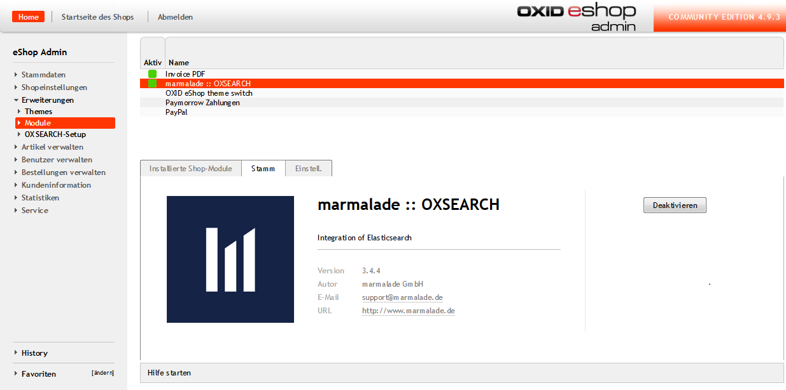

# Dokumentation OXSEARCH #

## Systemanforderungen ##

Um eine Einbindung von OXSEARCH in OXID zu gewährleisten, müssen folgende Komponenten installiert sein:

- PHP 5.3+  
- OXID 4.8+ oder höher  
- Php-curl: dies ist eine der Voraussetzungen für OXID und sollte bereits vorhanden sein.  
- Elasticsearch 1.1 bis 1.4 (Elasticsearch 1.5+ wird derzeit noch nicht unterstützt) 
- optionale Elasticsearch-Plugins für bessere Umlaut und Unicode Suche  
- elasticsearch-analysis-icu  
- elasticsearch-analysis-combo  

__Hinweise:__ 
- Ab Elasticsearch 1.2 muss dynamisches Scripting explizit aktiviert werden. Dazu muss in die Datei elasticsearch.yml die Zeile `script.disable_dynamic: false` eingefügt werden. 
- Mit Elasticsearch 1.4 wurde die von OXSEARCH verwendete Scriptsprache mvel abgeschafft. Zum Erhalt des vollen Funktionsumfangs ist es deshalb notwendig, diese in Form des Plugins elasticsearch-lang-mvel nachzuinstallieren.  
- Nach der Installation muss mvel als Standardsprache in der elasticsearch.yml eingetragen werden. `script.default_lang: "mvel"`	

## Installation ##

1. Downloaden Sie das Zip-Archiv von OXSEARCH.  
2. Extrahieren Sie die Dateien des Moduls nach <ShopRoot>/modules/marm/oxsearch.  
3. Prüfen Sie, ob  <ShopRoot>/modules/marm/vendormetadata.php existiert. Falls nicht, legen Sie diese Datei bitte an. Sie kann leer sein.  
4. Nun können Sie das Modul im Backend unter Erweiterungen > Module > marmalade:: OXSEARCH aktivieren.  
  
Sie erhalten nun auf der linken Seite unter Erweiterungen den neuen Menüpunkt OXSEARCH-Setup. In diesem Bereich können Sie bequem alle weiteren Einstellungen zum Modul vornehmen.

# OXSEARCH-Setup #

Um OXSEARCH erfolgreich in OXID einzubinden, müssen nun noch einige wesentliche Einstellungen im OXSEARCH-Setup vorgenommen werden. Das Setup besteht aus vier Reitern mit folgenden Einstellungsmöglichkeiten:  

- Im ersten Reiter OXSEARCH-Setup finden Sie Grund-, Such- & Filtereinstellungen.  
- Im zweiten Reiter können Sie Boosting & Synonyme konfigurieren.  
- Im dritten Reiter werden die Zugangsdaten zu Elasticsearch hinterlegt & die Indizierung gestartet.  
- Im vierten Reiter werden die Suchbegriffe fehlgeschlagener Suchen aufgelistet. 

  

## Elasticsearch-Verbindungsdaten und Indizierung ##

Bevor Sie OXSEARCH nutzen können ist es erforderlich, die Verbindungsdaten für Elasticsearch zu hinterlegen und die Indizierung zu starten.  

1. Wechseln Sie in den Reiter "Elasticsearch Konfiguration > Verbindungsdaten".  
2. Tragen Sie den Host in der Form [USER:PASSWORT@]ES-DOMAIN_ODER_IP ein.  
3. Legen Sie den Port fest, auf dem Elasticsearch auf Anfragen horcht, meistens ist das 9200.  
4. Speichern Sie zunächst die eingetragenen Verbindungsdaten, bevor Sie mit dem nächsten Schritt fortfahren.  
5. Öffnen Sie erneut die Verbindungseinstellungen zu Elasticsearch.  
6. Definieren Sie einen eindeutigen Indexnamen für den aktiven und den passiven Index.  
__Hinweis: der Indexname kann für beide Indizes gleich sein, muss aber unbedingt klein geschrieben werden, da sonst eine Fehlermeldung "Invalid JSON" auftritt.__  
Auf dem aktiven Index findet im Shop-Frontend die Suche statt, während der passive Index allein zur Indexerstellung benötigt wird. Bei Bedarf können die Indizes auf Knopfdruck getauscht werden. 

__Hinweis: Elasticsearch sollte mindestens mit einer "basic authorization" konfiguriert werden, um Manipulationen des Shop-Bestands von außen zu vermeiden!___

## Datenimport ##

*** Welche drei Importmöglichkeiten gibt es? Und was sind die Vor- und Nachteile der jeweiligen Methode? Abgrenzung unter einander, wann benutze ich welche Methode. ***

Der Datenimport kann vom Backend aus durch drücken der Schaltfläche Index jetzt neu aufbauen in der Elasticsearch-Konfiguration angestoßen werden. Im Produktivbetrieb kann ein Cronjob die folgende Skriptdatei `<ShopRoot>/modules/marm/oxsearch/importer/doImport.sh` ausführen.

### Update- & Delete-API ###

Die Klasse marmOxsearchImport besitzt einige Methoden zur Aktualisierung und Löschung von Artikeln:

- `updateArticle($articleId, $language = 0, $index = 'active')` aktualisiert einen einzelnen Artikel.  
- `updateArticles($articleIds, $language = 0, $index = 'active')` ist das äquivalent für eine Liste von Artikeln.  
- `deleteArticle($articleId, $index = 'active')` löscht einen Artikel.  
- `deleteArticles($articleIds, $index = 'active')` löscht mehrere Artikel. 

Der optionale Parameter $language wählt die Sprache anhand der Sprachnummern von OXID, während $index die Wahl zwischen aktivem (active) und inaktiven (inactive) Index erlaubt.

Verwendungsbeispiel:
- `$sOxid = oxRegistry::getConfig()->getRequestParameter('oxid');`
- `oxRegistry::get('marmOxsearchImport')->updateArticle($sOxid);`

__Hinweis: Die Listenmethoden sind mit Bedacht zu verwenden, da sie keine Begrenzung enthalten und große Artikelzahlen zu Speicher- oder Laufzeitüberschreitungen führen können.__  

## Reiter OXSEARCH-Setup ##

Die Grundeinstellungen von OXSEARCH sind in folgende Abschnitte unterteilt:  
- Grundeinstellungen für wesentliche Konfigurationsmöglichkeiten von OXSEARCH  
- Sucheinstellungen zur Festlegung von Suchkriterien  
- Produktfilter  

### Grundeinstellungen ###

- Aktivierung des Moduls 
- Listenansicht: Hier entscheiden Sie, ob für die Suche die Einstellungen von OXID verwendet oder ob die Filtereinstellungen von OXSEARCH genutzt werden. Nur bei Aktivierung des Kontrollkästchens kommen in OXSEARCH vorgenommene Filtereinstellungen zur Geltung.  
__Hinweis: Diese Option erfordert eine erneute Indizierung!__ 
*** Hier fehlt die Suche, die Beschreibung der Listenansicht, scheint die Beschreibung der SUche zu sein ***
- Autosuggestion unterbreitet während der Sucheingabe Vorschläge zu Suchbegriffen  
- Seitennummer an Artikel-URL anhängen: Bei mehrseitigen Listen wird ab Seite 2 die Seiten-Nummer in der URL hinterlegt. 
*** Wo wird die aktuelle Promotion gepflegt? *** 
- Aktuelle Promotion überschreibt Kategoriesortierung: Diese Einstellung nimmt Einfluss darauf, ob die Sortierung innerhalb einer Kategorie von der aktuellen Promotion ersetzt wird. Mit der Promotion von Artikeln können Sie Einfluss darauf nehmen, ob ein bestimmter Artikel ganz vorne oder weiter hinten in der Liste angezeigt wird.  
- Elternkategorien enthalten alle Produkte ihrer Kinder: Wenn Ihr Shop beispielsweise eine Kategorie "Computer und Zubehör" enthält, die aus den Unterkategorien "Computer" und "Zubehör" besteht, können Sie hier beeinflussen, ob bei der Auswahl der Kategorie alle zugeordneten Artikel der Unterkategorien angezeigt werden oder ob der Kunde sich erst für eine der genannten Unterkategorien entscheiden muss.  
__Hinweis: Diese Option erfordert eine neue Indizierung!__ 
*** Siehe Anmerkung Datenimport ***
- Artikel beim Speichern erneut indizieren: Wenn die Indizierung der Artikel durch einen ChronJob automatisch erfolgt, ist diese Option nicht zwingend erforderlich.  
- oxLocator für Suchergebnis-Detailseiten abschalten: Der oxLocator fügt den Detailseiten der Artikel Navigationslinks hinzu, mit deren Hilfe man zwischen den Artikeln hin- und herspringen kann (u. a. vorheriger Artikel, nächster Artikel, etc.).  
___Hinweis: Der aktivierte oxLocator wirkt sich negativ auf die Performance aus.___
- Trennzeichen für Attribute mit mehreren Wertausprägungen: Wenn ein Artikel beispielsweise aus mehreren Materialien besteht, besteht das Attribut "Material" aus zwei Wertausprägungen. Das Trennzeichen stellt sicher, dass beide Materialien für den betreffenden Artikel gespeichert werden.  

### Sucheinstellungen ###

In den Sucheinstellungen können Sie Suchfilter festlegen. Alle diese Ergebnisse wirken sich auf die Suchergebnisse aus.  
- Gewichtete Suchfilter: Hier werden die Wertigkeiten für Suchfelder angegeben. Ein klassischer Anwendungsfall wäre, dass die Artikeltitel mit einer Wertigkeit von 10 höher gewichtet wird als der Suchbegriff in der Kurzbeschreibung, die beispielhaft mit 3 angegeben wird.  
- Attribute Durchsuchen: Attribute sind Eigenschaften, die ein Artikel enthalten kann (Verschiedene Größen, Farben, etc.). Ist diese Option aktiviert, könnte der Endkunde im Shop-Frontend beispielsweise Suchanfragen mit Attributsausprägungen `blau` auslösen.  
- Varianten durchsuchen  
*** Wieviele Buchstaben können falsch sein bei der Fuzzy-Suche? ***
- Zusätzliche Fuzzy-Suche: Die Fuzzy-Suche korrigiert Tippfehler wie Buchstabendreher.
*** Was ist der Vorteil der Wildcard-Suche, ausser, dass sie langsam ist? ***  
- Wildcard-Suche: Hier können Sie entscheiden, ob für die Suche auch Platzhalter genutzt werden können.  
___Hinweis: Die Wildcard-Suche wirkt sich negativ auf die Performance aus!___  
- Bei Einzelergebnissen nicht zum Artikel weiterleiten: Mit dieser Option beeinflussen Sie, ob im Falle eines einzigen Treffers auf die Suchergebnisseite oder direkt zum Artikel weitergeleitet wird. 
*** Das passt noch nicht, bitte nochmal nachfragen *** 
- Zeige Suchvorschläge: Hier werden verwandte Suchbegriffe in die Ergebnisliste einbezogen.  
- OXSEARCH-Keys: Hier legen Sie fest, welche Felder (Artikelbezeichnung, Kurzbeschreibung, Langbeschreibung, etc.) in die Suche einbezogen werden sollen.
*** Wo werden diese angezeigt? ***
- Zeige gefundene Kategorien: Bei aktivierter Option sieht der Endkunde, in welchen Kategorien Treffer gefunden wurden.
- Zeige gefundene Hersteller listet gefundene Hersteller des gesuchten Artikels  
c
- Zeige gefundene Links: Ist diese Option aktiviert, kann man im Shop beispielsweise Zahlungs- und Versandbedingungen oder Öffnungszeiten suchen.  
*** Stimmt so nicht, was ist hier der default-Wert? ***
- Cutoff-Häufigkeit: Hier können Sie Suchbegriffe ausschließen, die Sie als irrelevant erachten (der, die, das, etc.)
*** Was kann man damit erreichen? ***  
- Preisbereich für Suchergebnisse (von ... bis ...)  
- Abfrage-Verknüpfung: In dieser Select-Box wählen Sie aus, ob alle oder mindestens einer der abgefragten Kriterien zutreffen.  

### Produktfilter ### 

In diesem Reiter können Sie Produktfilter konfigurieren.
*** Stimmt so nicht, bitte hier nur die Auswirkung beschreiben ***
- SEO-URLS für gefilterte Seiten verwenden: SEO-URLS bieten sich generell an, weil der Kunde sie sich besser merken kann und Suchmaschinen diese in ihre Ergebnislisten mit einbeziehen.  
- Anzahl gefundener Artikel am Filterwert anzeigen: Ist diese Option aktiviert, wird im Frontend sichtbar, wie viele Artikel für den aktivierten Filter gefunden wurden.
*** unverständlich formuliert ***
- Selektierte Filter nicht nach vorne sortieren: Hier können Sie beeinflussen, ob die selektierte Filtersortierung erhalten bleibt, sobald mehr Artikel als in der Standardanzeige definiert angezeigt werden. 
*** unverständlich formuliert *** 
- Kategoriefilter aktivieren: In der Suche kann bei gesetztem Häkchen entschieden werden, in welchen Kategorien gesucht werden soll. 
*** Stimmt so nicht ***
- Trennzeichen für dynamische Kategorien: Dynamische Kategorien werden aus Elasticsearch befüllt und bestehen aus Kombinationen bereits bestehender Kategorien. Das Trennzeichen muss sich von dem Trennzeichen für Kategorien in den Sucheinstellungen unterscheiden, damit die dynamische Kategorie von den statischen Kategorien unterschieden werden können. Ein Beispiel für eine dynamische Kategorie wäre, alle lieferbaren Artikel eines Herstellers anzuzeigen. 
*** Stimmt so nicht, wie erfolgt die Mehrsprachige Pflege? *** 
- Attribute: Hier können Sie Attribute für Artikel wie Farbe und Größe bei Bekleidung definieren. Bei Festlegung von Attributen würde für Kleidung, die in mehreren Farben und Größen verfügbar sind, nur der Elternartikel, angezeigt und der Endkunde kann innerhalb eines Artikels die Farben und Größen auswählen. Legen Sie keine Attribute fest, müssen Sie für jede Farb- und Größenkombination einen säparaten Artikel anlegen. 
*** Der Punkt Artikel fehlt *** 
- Script: Hier können Sie Scripts erstellen, die mehrere Werte prüfen und im Shop beispielsweise als Sonderposten, Saisonartikel, etc. angezeigt werden.  

## Reiter Synonyme und suchbare Links ##

Der nächste Punkt in den OXSEARCH-Einstellungen befasst sich mit Synonymen und suchbaren Links. Er ist in folgende Abschnitte unterteilt:  
- dynamisches Boosting  
- Suchbare Links  
- Synonyme  

### Dynamisches Boosting ###

Das dynamische Boosting ermöglicht es, die Position von Produkten in der Kategorieansicht oder bei Suchergebnissen zu beeinflussen. Dies geschieht anhand sich dynamisch ändernder Werte wie Verkaufszahlen oder Detailseitenaufrufe. Sie können hier die Faktoren festlegen, mit denen die einzelnen Statistiken gewichtet werden.  
  
- Dynamisches Boosting aktivieren: Wenn das dynamische Boosting deaktiviert ist, profitieren Sie nicht von den weiter unten festgelegten Wichtungskriterien.  
- Auf Kategorien anwenden: Wenn Sie sich für diese Option entscheiden, wird die Kategoriesortierung verworfen.  
*** Was sind gute Default-Werte? insbesondere auch im Gesamtkontext mit allen anderen Einstellungen, wie Relevanzfaktor? Boosting vs. relevante Suchergebnisse? ***
- Boostfaktor Anzahl der Verkäufe  
- Boostfaktor in den Warenkorb gelegt  
- Boostfaktor Anzahl der Detailseitenaufrufe  
*** Das ist nur der Default-Wert, bitte einen Vorschlag machen! ***
- Boostfaktor Promotionen
*** Wozu braucht man das? ***  
- Relevanzexponent: Mit ihm legen Sie fest, mit welchem Faktor die Wichtungen potenziert werden.  
- Debug-Modus aktivieren: Wenn der Administrator im Frontend eingeloggt ist sehen Sie, wie sich Ihre Gewichtungskriterien auf eine Suche oder Kategorieliste auswirken.  

### Suchbare Links ###

*** Diese werden nur angezeigt wenn unter Sucheinstellungen der entsprechnde Hacken gesetzt wurde, ausßerdem tauchen diese noch in der Autosuggestion auf. Wie erfolgt eine Übersetzung***
Hier legen Sie fest, welche Links in der Suche aufgeführt werden sollen. Beispiele wären Zahlungs- und Versandbedingungen oder Öffnungszeiten, die in einer Suche auftauchen könnten.   
  
Folgende Angaben werden für einen Link benötigt:  
- Titel  
- extern  
- Seite  

### Synonyme ###

Hier können Sie Synonyme pflegen.  
  
Wenn die Statistik der Suchanfragen ohne Ergebnisse zeigt, dass "Softdrinks" keine Treffer ergeben, können Sie "alkoholfreie Getränke" als Synonym festlegen, damit "Softdrinks" künftig zum gewünschten Ergebnis führt.  
___Hinweis: Die Festlegung von Synonymen erfordert eine Aktualisierung des Index!___  

### Suchanfragen ohne Ergebnis ###

Diese Seite zeigt Ihnen an, welche Suchanfragen ohne Ergebnis blieben.  
 
Bei der Auswertung bietet es sich an, Synonyme zu pflegen, die mit den ergebnislosen Suchanfragen verwandt sind.  

# Anmerkungen # 
## Landing-Pages und Promotionen ## 

*** Wofür nutzt man Promotions? Beispiele! ***
Landing-Pages und Promotionen lassen sich über das Aktionen-Interface von OXID anlegen und sind mit dynamisch anzuwendenden Filtern ausstatten.  

## Kategorien ## 

*** Wofür nutzt man dyn. Kategorie? Beispiele! ***
Kategorien können dynamisch mit Artikeln befüllt werden. Verwenden Sie hierzu in OXID unter Artikel verwalten > Kategorien > den Tab __"Dynamische Artikelwahl"__, unter welchem Sie die in der OXSEARCH-Konfiguration definierten Filter mit Werten belegen können. Die verwendbaren Filter müssen dafür nicht einmal aktiv sein, sondern lediglich mit einem eindeutigen Parameternamen versehen werden. Unter dem Tab __Sichtbare Filter__ können sie zusätzlich auswählen, welche Filter für die jeweilige Kategorie sichtbar sein sollen.

## Mehrsprachigkeit ##
*** Bitte Pflegehinweise ***

## Mandantenfähigkeit ##
*** Wird für jeden Mandant ein eigener Index angelegt oder nur für Sprachen, etc. ? *** 

## Support von OXID-Standardfunktionalitäten ##
*** Welche Funktionen werden nicht unterstützt ***
- Rollen und Rechte im Frontend