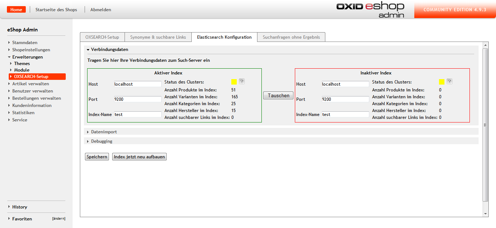
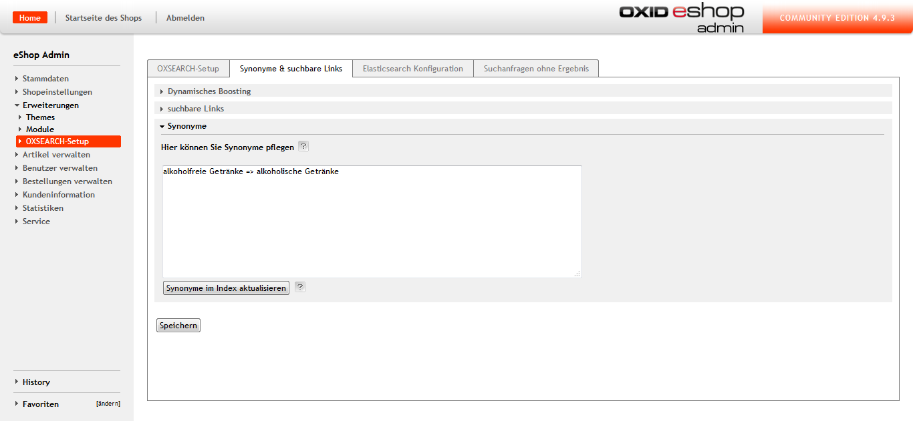

# Dokumentation OXSEARCH #

## Systemanforderungen ##

Um eine Einbindung von OXSEARCH in OXID zu gewährleisten, müssen folgende Komponenten installiert sein:

- PHP 5.3+  
- OXID 4.8+ oder höher  
- Php-curl: dies ist eine der Voraussetzungen für OXID und sollte bereits vorhanden sein.  
- Elasticsearch 1.1 bis 1.4 (Elasticsearch 1.5+ wird derzeit noch nicht unterstützt) 
- optionale Elasticsearch-Plugins für bessere Umlaut und Unicode Suche  
- elasticsearch-analysis-icu  
- elasticsearch-analysis-combo  

__Hinweise:__ 
- Ab Elasticsearch 1.2 muss dynamisches Scripting explizit aktiviert werden. Dazu muss in die Datei elasticsearch.yml die Zeile `script.disable_dynamic: false` eingefügt werden. 
- Mit Elasticsearch 1.4 wurde die von OXSEARCH verwendete Scriptsprache mvel abgeschafft. Zum Erhalt des vollen Funktionsumfangs ist es deshalb notwendig, diese in Form des Plugins elasticsearch-lang-mvel nachzuinstallieren.  
- Nach der Installation muss mvel als Standardsprache in der elasticsearch.yml eingetragen werden. `script.default_lang: "mvel"`	

## Installation ##

1. Downloaden Sie das Zip-Archiv von OXSEARCH.  
2. Extrahieren Sie die Dateien des Moduls nach <ShopRoot>/modules/marm/oxsearch.  
3. Prüfen Sie, ob  <ShopRoot>/modules/marm/vendormetadata.php existiert. Falls nicht, legen Sie diese Datei bitte an. Sie kann leer sein.  
4. Nun können Sie das Modul im Backend unter Erweiterungen > Module > marmalade:: OXSEARCH aktivieren.  
  
Sie erhalten nun auf der linken Seite unter Erweiterungen den neuen Menüpunkt OXSEARCH-Setup. In diesem Bereich können Sie bequem alle weiteren Einstellungen zum Modul vornehmen.

# OXSEARCH-Setup #

Um OXSEARCH erfolgreich in OXID einzubinden, müssen nun noch einige wesentliche Einstellungen im OXSEARCH-Setup vorgenommen werden. Das Setup besteht aus vier Reitern mit folgenden Einstellungsmöglichkeiten:  

- Im ersten Reiter OXSEARCH-Setup finden Sie Grund-, Such- & Filtereinstellungen.  
- Im zweiten Reiter können Sie Boosting & Synonyme konfigurieren.  
- Im dritten Reiter werden die Zugangsdaten zu Elasticsearch hinterlegt & die Indizierung gestartet.  
- Im vierten Reiter werden die Suchbegriffe fehlgeschlagener Suchen aufgelistet. 

  

## Elasticsearch-Verbindungsdaten und Indizierung ##

Bevor Sie OXSEARCH nutzen können ist es erforderlich, die Verbindungsdaten für Elasticsearch zu hinterlegen und die Indizierung zu starten.  

1. Wechseln Sie in den Reiter "Elasticsearch Konfiguration > Verbindungsdaten".  
2. Tragen Sie den Host in der Form [USER:PASSWORT@]ES-DOMAIN_ODER_IP ein.  
3. Legen Sie den Port fest, auf dem Elasticsearch auf Anfragen horcht, meistens ist das 9200.  
4. Speichern Sie zunächst die eingetragenen Verbindungsdaten, bevor Sie mit dem nächsten Schritt fortfahren.  
5. Öffnen Sie erneut die Verbindungseinstellungen zu Elasticsearch.  
6. Definieren Sie einen eindeutigen Indexnamen für den aktiven und den passiven Index.  
__Hinweis: der Indexname kann für beide Indizes gleich sein, muss aber unbedingt klein geschrieben werden, da sonst eine Fehlermeldung "Invalid JSON" auftritt.__  
Auf dem aktiven Index findet im Shop-Frontend die Suche statt, während der passive Index allein zur Indexerstellung benötigt wird. Bei Bedarf können die Indizes auf Knopfdruck getauscht werden. 

__Hinweis: Elasticsearch sollte mindestens mit einer "basic authorization" konfiguriert werden, um Manipulationen des Shop-Bestands von außen zu vermeiden!___

## Datenimport ##

Der Datenimport kann auf drei verschiedene Arten durchgeführt werden.  
- Im Backend durch drücken der Schaltfläche "Index jetzt neu aufbauen" im Reiter Elasticsearch-Konfiguration  
- mittels eines Cronjobs, der die Skriptdatei `<ShopRoot>/modules/marm/oxsearch/importer/doImport.sh` ausführt  
- mit Hilfe der Update- & Delete-API  

Wenn Sie die Schaltfläche im Backend benutzen, wirken sich vorgenommene Änderungen sofort aus. Je nach Datenmenge, kann der Neuaufbau einige Zeit in Anspruch nehmen und die Konfigurationsseite muss während des Indexaufbaus geöffnet bleiben, ansonsten bricht der Indexaufbau ab. 
Das Update durch den Cronjob geschieht im Hintergrund und bedarf keiner aktiven Ausführung, genau wie die Schaltfläche "Index jetzt neu aufbauen" im Backend handelt es sich hier um einen Vollimport, der in Abhängigkeit zur Datenmenge einige Zeit in Anspruch nehmen kann.  
Die Update- und Delete-API bietet sich an, wenn gezielte Aktualisierungen vorgenommen werden sollen. 

### Update- & Delete-API ###

Die Klasse marmOxsearchImport besitzt einige Methoden zur Aktualisierung und Löschung von Artikeln:

- `updateArticle($articleId, $language = 0, $index = 'active')` aktualisiert einen einzelnen Artikel.  
- `updateArticles($articleIds, $language = 0, $index = 'active')` ist das äquivalent für eine Liste von Artikeln.  
- `deleteArticle($articleId, $index = 'active')` löscht einen Artikel.  
- `deleteArticles($articleIds, $index = 'active')` löscht mehrere Artikel. 

Der optionale Parameter $language wählt die Sprache anhand der Sprachnummern von OXID, während $index die Wahl zwischen aktivem (active) und inaktiven (inactive) Index erlaubt.

Verwendungsbeispiel:
- `$sOxid = oxRegistry::getConfig()->getRequestParameter('oxid');`
- `oxRegistry::get('marmOxsearchImport')->updateArticle($sOxid);`

__Hinweis: Die Listenmethoden sind mit Bedacht zu verwenden, da sie keine Begrenzung enthalten und große Artikelzahlen zu Speicher- oder Laufzeitüberschreitungen führen können.__  

## Reiter OXSEARCH-Setup ##

Die Grundeinstellungen von OXSEARCH sind in folgende Abschnitte unterteilt:  
- Grundeinstellungen für wesentliche Konfigurationsmöglichkeiten von OXSEARCH  
- Sucheinstellungen zur Festlegung von Suchkriterien  
- Produktfilter  

### Grundeinstellungen ###

- Aktivierung des Moduls 
- Listenansicht: legt fest, ob für Kategorielisten der OXID- oder OXSEARCH-Standard verwendet wird. Erst bei gesetztem Haken profitieren Sie von vorgenommenen Filtereinstellungen.  
- Suche: Hier entscheiden Sie, ob für die Suche die Einstellungen von OXID verwendet oder ob die Filtereinstellungen von OXSEARCH genutzt werden. Nur bei Aktivierung des Kontrollkästchens kommen in OXSEARCH vorgenommene Filtereinstellungen zur Geltung.  
__Hinweis: Diese Option erfordert eine erneute Indizierung!__ 
- Autosuggestion unterbreitet während der Sucheingabe Vorschläge zu Suchbegriffen  
- Seitennummer an Artikel-URL anhängen: Bei mehrseitigen Listen wird ab Seite 2 die Seiten-Nummer in der URL hinterlegt. 
- Aktuelle Promotion überschreibt Kategoriesortierung: Diese Einstellung nimmt Einfluss darauf, ob die Sortierung innerhalb einer Kategorie von der aktuellen Promotion ersetzt wird. Mit der Promotion von Artikeln können Sie Einfluss darauf nehmen, ob ein bestimmter Artikel oder eine Gruppe von Artikel ganz vorne oder weiter hinten in der Liste angezeigt wird. Promotionen können Sie in OXID unter Kundeninformation > Aktionslisten oder direkt am Artikel unter Artikel verwalten > Artikel > Reiter Erweitert (Boost-Wert) pflegen.  
- Elternkategorien enthalten alle Produkte ihrer Kinder: Wenn Ihr Shop beispielsweise eine Kategorie "Computer und Zubehör" enthält, die aus den Unterkategorien "Computer" und "Zubehör" besteht, können Sie hier beeinflussen, ob bei der Auswahl der Kategorie alle zugeordneten Artikel der Unterkategorien angezeigt werden oder ob der Kunde sich erst für eine der genannten Unterkategorien entscheiden muss.  
__Hinweis: Diese Option erfordert eine neue Indizierung!__ 
- Artikel beim Speichern erneut indizieren: Wenn die Indizierung der Artikel durch einen ChronJob automatisch erfolgt, ist diese Option optional.  
- oxLocator für Suchergebnis-Detailseiten abschalten: Der oxLocator fügt den Detailseiten der Artikel Navigationslinks hinzu, mit deren Hilfe man zwischen den Artikeln hin- und herspringen kann (u. a. vorheriger Artikel, nächster Artikel, etc.).  
___Hinweis: Der aktivierte oxLocator wirkt sich negativ auf die Performance aus.___
- Trennzeichen für Attribute mit mehreren Wertausprägungen: Wenn ein Artikel beispielsweise aus mehreren Materialien besteht, besteht das Attribut "Material" aus zwei Wertausprägungen. Das Trennzeichen stellt sicher, dass beide Materialien für den betreffenden Artikel gespeichert werden.  

### Sucheinstellungen ###

In den Sucheinstellungen können Sie Suchfilter festlegen. Alle diese Ergebnisse wirken sich auf die Suchergebnisse aus.  
- Gewichtete Suchfilter: Hier werden die Wertigkeiten für Suchfelder angegeben. Ein klassischer Anwendungsfall wäre, dass die Artikeltitel mit einer Wertigkeit von 10 höher gewichtet wird als der Suchbegriff in der Kurzbeschreibung, die beispielhaft mit 3 angegeben wird.  
- Attribute Durchsuchen: Attribute sind Eigenschaften, die ein Artikel enthalten kann (Verschiedene Größen, Farben, etc.). Ist diese Option aktiviert, könnte der Endkunde im Shop-Frontend beispielsweise Suchanfragen mit Attributsausprägungen `blau` auslösen.  
- Varianten durchsuchen: Die Variante eines Artikels hat immer einen Elternartikel, von dem die Variante erbt. Im Fall von Bekleidung in verschiedenen Größen würde das bedeuten, dass es einen Artikel für ein bestimmtes Kleidungsstück gibt und die Varianten (verschiedene Farben und Größen) die jeweiligen Kindartikel sind. Im Frontend wird nur ein Artikel angezeigt und innerhalb des Artikels kann der Kunde mittels einer Dropdown-Liste die präferierte Variante wählen.  
- Zusätzliche Fuzzy-Suche: Die Fuzzy-Suche korrigiert Tippfehler wie Buchstabendreher. Mindestens 30 % des Wortes müssen dabei richtig geschrieben sein. 
- Wildcard-Suche: Hier können Sie entscheiden, ob für die Suche auch Platzhalter genutzt werden können. Wildcards sind sinnvoll, wenn der Name eines Artikels aus zusammengesetzten Wörtern besteht. Je nachdem, aus wie Vielen Wörtern der Begriff zusammen gesetzt ist, werden betroffene Artikel nicht immer zuverlässig gefunden. "Kiteboard" im OXID Demoshop besteht nur aus zwei zusammen gesetzten Wörtern und würde auch ohne Wildcard-Suche gefunden werden, wenn es jetzt aber "Kiteboard-Hüllen" gibt, würden ohne Wildcard-Suche hauptsächlich alle Treffer mit "Kiteboard" und "Hülle" ausgegeben werden.  
___Hinweis: Die Wildcard-Suche wirkt sich negativ auf die Performance aus!___  
- Bei Einzelergebnissen nicht zum Artikel weiterleiten: Mit dieser Option beeinflussen Sie, ob im Falle eines einzigen Treffers auf die Suchergebnisseite oder direkt zum Artikel weitergeleitet wird. 
- Zeige Suchvorschläge: Während der Sucheingabe wird mit Hilfe von Autosuggestion der Suchbegriff vervollständigt.  
- OXSEARCH-Keys: Hier legen Sie fest, welche Felder (Artikelbezeichnung, Kurzbeschreibung, Langbeschreibung, etc.) in die Suche einbezogen werden sollen.
- Zeige gefundene Kategorien: Bei aktivierter Option sind in der Trefferliste im Frontend alle Kategorien sichtbar, in denen Treffer gefunden wurden.  
- Zeige gefundene Hersteller listet gefundene Hersteller des gesuchten Artikels  
- Zeige gefundene Links: Ist diese Option aktiviert, kann man im Shop beispielsweise Zahlungs- und Versandbedingungen oder Öffnungszeiten suchen.  
- Cutoff-Häufigkeit: Hier können Sie einen absoluten oder relativen Wert festlegen, der häufig auftauchenden Wörtern wie "der", "die", "das" eine geringere Relevanz zuordnet und in einem Subquerry verarbeitet, damit die Trefferliste möglichst exakte Ergebnisse liefert.  
- Preisbereich für Suchergebnisse (von ... bis ...): Hier können Sie die angezeigten Artikel auf den von Ihnen gewünschten Preisbereich beschränken. Dies ist sehr hilfreich, wenn Sie beispielsweise kostenlose Artikel, wie Dreingaben aus den Suchergebnissen ausschließen wollen.
- Abfrage-Verknüpfung: In dieser Select-Box wählen Sie aus, ob alle oder mindestens einer der abgefragten Kriterien zutreffen.  

### Produktfilter ### 

In diesem Reiter können Sie Produktfilter konfigurieren.
- SEO-URLS für gefilterte Seiten verwenden: Wenn diese Option deaktiviert ist, werden alle Filter in Form von Parametern an die URL angehängt. Je nach gewählten Filtern kann die Länge der URL zu Problemen führen, so dass die gewünschte Seite nicht angezeigt werden kann.
- Anzahl gefundener Artikel am Filterwert anzeigen: Ist diese Option aktiviert, wird im Frontend sichtbar, wie viele Artikel für den aktivierten Filter gefunden wurden.
- Selektierte Filter nicht nach vorne sortieren: in einer Multiselectbox werden ausgewählte Filter nicht nach vorne sortiert, sondern in der ursprünglichen Filtersortierung angezeigt. Je nach Anzahl der Elemente in der Selektbox bedeutet dies bei nicht gesetztem Haken, dass Sie scrollen müssen, um die selektierten Filter zu finden.  
- Kategoriefilter aktivieren: In der Ergebnisliste werden die Kategorien angezeigt, die den Suchbegriff enthalten.  
- Trennzeichen für dynamische Kategorien: Dynamische Kategorien werden von Elasticsearch aus bestehenden Artikeln befüllt. Die Beispielkategorie "Geschenkartikel unter 100 EUR" könnte alle Artikel unter 100 EUR enthalten. Das Trennzeichen für dynamische Kategorien muss sich von dem für statische Kategorien unterscheiden.  
*** Stimmt so nicht, wie erfolgt die Mehrsprachige Pflege? *** 
- Attribute: Hier können Sie Attribute für Artikel wie Farbe und Größe bei Bekleidung definieren, auf die OXSEARCH filtern kann.
*** Der Punkt Artikel fehlt ***   
- Skript: Hier können Sie Scripts erstellen, die mehrere Werte prüfen und im Shop beispielsweise als Sonderposten, Saisonartikel, etc. angezeigt werden.  

## Reiter Synonyme und suchbare Links ##

Der nächste Punkt in den OXSEARCH-Einstellungen befasst sich mit Synonymen und suchbaren Links. Er ist in folgende Abschnitte unterteilt:  
- dynamisches Boosting  
- Suchbare Links  
- Synonyme  

### Dynamisches Boosting ###

Das dynamische Boosting ermöglicht es, die Position von Produkten in der Kategorieansicht oder bei Suchergebnissen zu beeinflussen. Dies geschieht anhand sich dynamisch ändernder Werte wie Verkaufszahlen oder Detailseitenaufrufe. Sie können hier die Faktoren festlegen, mit denen die einzelnen Statistiken gewichtet werden.  
  
- Dynamisches Boosting aktivieren: Wenn das dynamische Boosting deaktiviert ist, profitieren Sie nicht von den weiter unten festgelegten Wichtungskriterien.  
- Auf Kategorien anwenden: Wenn Sie sich für diese Option entscheiden, wird die Kategoriesortierung verworfen.  
- Boostfaktor Anzahl der Verkäufe  
- Boostfaktor in den Warenkorb gelegt  
- Boostfaktor Anzahl der Detailseitenaufrufe  
- Boostfaktor Promotionen: Dies ist ein vorgeschlagener Defaultwert von OXID. Ihren Wünschen entsprechend können Sie dieses Feld beliebig konfigurieren, beispielsweise nach Anzahl der Verkäufe.  
- Relevanzexponent: Mit ihm legen Sie fest, mit welchem Faktor die Wichtungen potenziert werden. Dies dient zur Abwertung von unscharfen Treffern im Suchergebniss.
Folgende Formel wird angewandt:  
Boostfaktor Wert multipliziert mit Relevanz potenziert mit Relevanzexponent  
Die Werte eines Artikels werden dabei addiert.
__Hinweis: Wir empfehlen folgende Werte:  
- In den Warenkorb gelegt: 10  
- Anzahl Detailseitenaufrufe: 1  
- Anzahl Verkäufe: 100  __
- Debug-Modus aktivieren: Wenn der Administrator im Frontend eingeloggt ist sehen Sie, wie sich Ihre Gewichtungskriterien auf eine Suche oder Kategorieliste auswirken.  

### Suchbare Links ###

Hier legen Sie fest, welche Links in der Suche aufgeführt werden sollen, wenn diese in den Sucheinstellungen aktiviert sind. Beispiele wären Zahlungs- und Versandbedingungen oder Öffnungszeiten, die auch in der Autosuggestion auftauchen.  
  
Folgende Angaben werden für einen Link benötigt:  
- Titel  
- extern  
- Seite  
___Hinweis: für die suchbaren Links müssen mehrsprachige Versionen einer Seite explizit festgelegt werden, für die AGB-Seite müssten Sie beispielsweise auch die terms of service-Seite aufführen!___  

### Synonyme ###

Hier können Sie Synonyme pflegen.  
  
Wenn die Statistik der Suchanfragen ohne Ergebnisse zeigt, dass "Softdrinks" keine Treffer ergeben, können Sie "alkoholfreie Getränke" als Synonym festlegen, damit "Softdrinks" künftig zum gewünschten Ergebnis führt.  
___Hinweis: Die Festlegung von Synonymen erfordert eine Aktualisierung des Index!___  

### Suchanfragen ohne Ergebnis ###

Diese Seite zeigt Ihnen an, welche Suchanfragen ohne Ergebnis blieben.  
 
Bei der Auswertung bietet es sich an, Synonyme zu pflegen, die mit den ergebnislosen Suchanfragen verwandt sind.  

# Anmerkungen # 
## Landing-Pages und Promotionen ## 

Landing-Pages und Promotionen lassen sich über das Aktionen-Interface von OXID anlegen und mit dynamisch anzuwendenden Filtern ausstatten. Anwendungsbeispiele wären Wochen- und Monatsangebote oder beliebteste Artikel.  

## Kategorien ## 

Kategorien können dynamisch mit Artikeln befüllt werden. Verwenden Sie hierzu in OXID unter Artikel verwalten > Kategorien > den Tab __"Dynamische Artikelwahl"__, unter welchem Sie die in der OXSEARCH-Konfiguration definierten Filter mit Werten belegen können. Die verwendbaren Filter müssen dafür nicht einmal aktiv sein, sondern lediglich mit einem eindeutigen Parameternamen versehen werden. Unter dem Tab __Sichtbare Filter__ können sie zusätzlich auswählen, welche Filter für die jeweilige Kategorie sichtbar sein sollen.  
Beispiel für sinnvolle dynamische Kategorie wären Geschenkartikel oder Wochen/Monatsangebote. 

## Mehrsprachigkeit ##

Für die Mehrsprachigkeit Ihres Shops empfiehlt es sich, eine Sprachvariable zu definieren. Wenn ein entsprechender Filter auf die Variable gesetzt ist, wird bei mehrsprachigen Varianten einer Seite oder eines Artikels die richtige angezeigt, im Frontend sieht der Nutzer in jedem Artikel per default die in seiner Sprache verfügbare Version. Jede Sprache verfügt dabei über ihren eigenen Index und muss separat gepflegt werden. Bei der Artikelpflege müssen Sie also immer auswählen, in welcher Sprache der Artikel editiert werden soll. Dies geschieht mit Hilfe einer Dropdown-Liste.  

## Mandantenfähigkeit ##

*** unglückig formuliert ***
OXSEARCH unterstützt keine Mandantenfähigkeit. Konkret bedeutet dies, dass Sie für den Fall, dass Sie Subshops pflegen, OXSEARCH für jeden Subshop säparat installieren und konfigurieren müssen.  

## Support von OXID-Standardfunktionalitäten ##

Die folgenden OXID-Grundfunktionen werden von OXSEARCH nicht unterstützt:  
- Rollen und Rechte im Frontend  
- Subshop-Vererbung  
*** Was ist mit dyn. Caching? High-Performancen Option - Varnish?***
