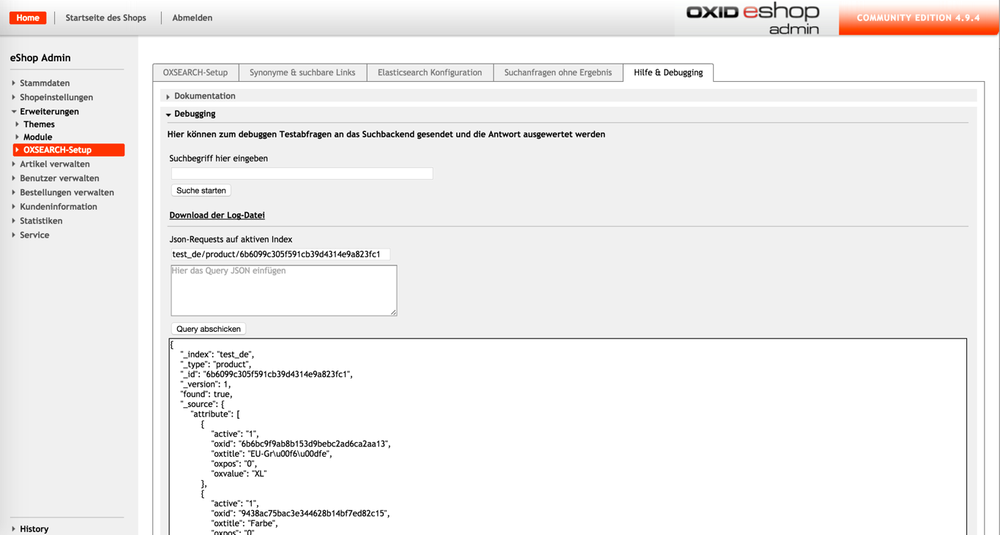

# Debugging Elasticsearch

Im Bereich Debugging des Reiters 'Elasticsearch Konfiguration' des OXSEARCH-Setup können Testabfragen an Elasticsearch gesendet werden.

  

Zum einen ist es möglich die Suche nach einem bestimmten Begriff zu prüfen, indem man im zugehörigen Feld den Suchbegriff eingibt und die Suche startet.
Die Antwort des Elasticsearch-Servers wird in einer Datei gespeichert, die man sich anschließend herunterladen kann.

Weiterhin ist es hier möglich GET Requests direkt an Elasticsearch zu senden.
Dies ermöglicht beispielsweise die Konfiguration des Elasticsearch-Servers zu prüfen,
z.B. die Elasticsearch-Version, installierte Plugins, angelegte Indizes und das Mapping der indizierten Felder.
Es ist aber auch möglich bestimmte Elasticsearch Dokumente abzurufen oder das Ergebnis eigener Suchanfragen zu ermitteln.

