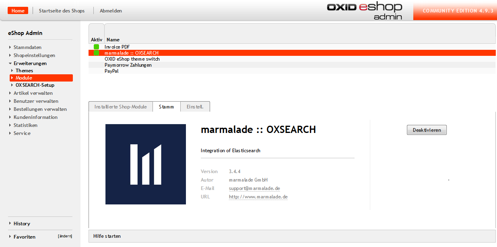

# Installation

1. Downloaden Sie das Zip-Archiv von OXSEARCH.  
2. Extrahieren Sie die Dateien des Moduls nach <ShopRoot>/modules/marm/oxsearch.  
3. Prüfen Sie, ob  <ShopRoot>/modules/marm/vendormetadata.php existiert. Falls nicht, legen Sie diese Datei bitte an. Sie kann leer sein.  
4. Nun können Sie das Modul im Backend unter Erweiterungen > Module > marmalade :: OXSEARCH aktivieren.  
  
Sie erhalten nun auf der linken Seite unter Erweiterungen den neuen Menüpunkt OXSEARCH-Setup. In diesem Bereich können Sie bequem alle weiteren Einstellungen zum Modul vornehmen.
