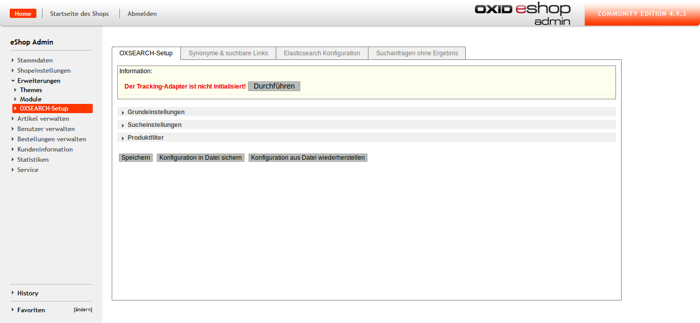
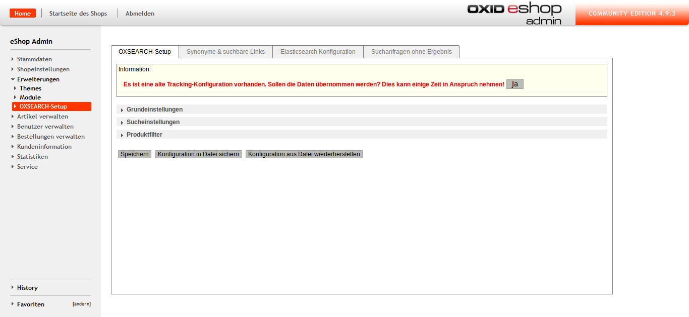
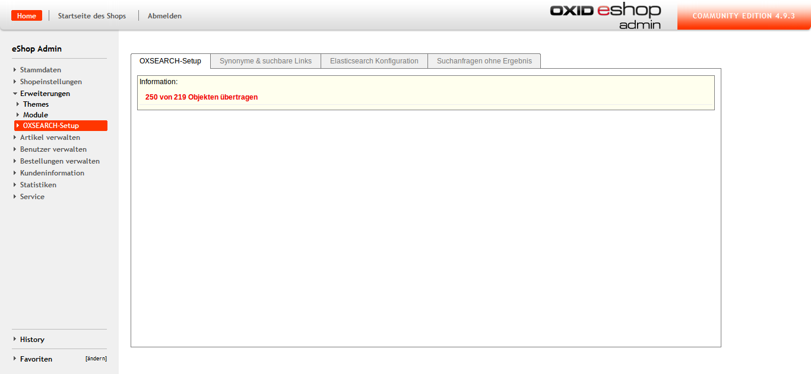

# Migration #

## Migration von Tracking-Daten ##

Soll der zum Einsatz kommende Tracking-Adapter geändert werden müssen folgende Schritte befolgt werden:

 1. Der neue Adapter muss mit der Option `$this->aOxSearchTracking` in der `config.inc.php` konfiguriert werden.
    Eine ältere Konfiguration sollte zu `$this->aFormerOxSearchTracking` umbenannt werden.
 2. Im Backend kann das neue System, sofern notwendig, im Punkt _Erweiterungen > OXSEARCH-Setup_ aktiviert werden.
 
    
    
 3. Sofern eine ältere Konfiguration vorhanden ist kann diese nun migriert werden:
 
    
    
    Dies kann einige Zeit dauern.
 
    

 4. Nach Ende der Migration kann die Option `$this->aFormerOxSearchTracking` aus der `config.inc.php` entfernt werden.

## Migration von Version 3.6.3 oder älter auf 3.7.0 ##

 1. Die OXSEARCH-Einstellungen müssen mittels des Buttons im Backend gesichert werden.
 2. Das Modul muss vor dem Update deaktiviert und danach reaktiviert werden.
 3. Um alte Tracking-Daten zu erhalten muss in der `config.inc.php` die Option `$this->aFormerOxSearchTracking = array('adapter' => 'marm_oxsearch_intable_tracking');`
    gesetzt sein und die Schritte 3 und 4 von oben ausgeführt werden.
 4. Sofern der Block `details_productmain_title` im Template `page/details/inc/productmain.tpl` nicht existiert muss in einem Detailseiten-Template folgende Zeile eingefügt werden:

        [{include file="widget/tracking.tpl" product=$oDetailsProduct key="requested" delay=10000}]
