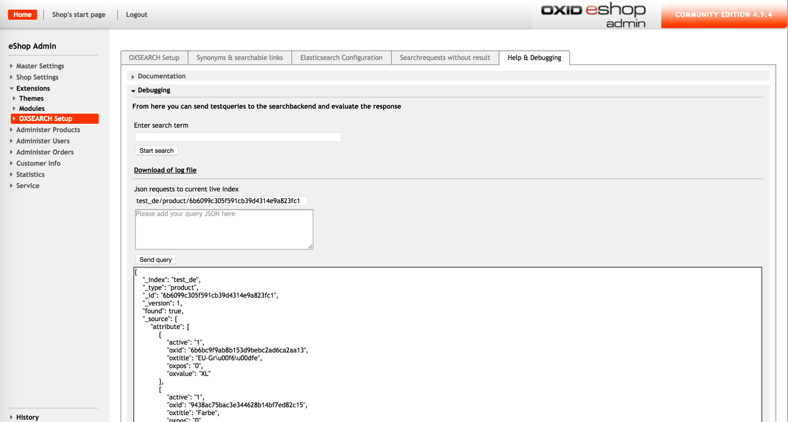

# Debugging Elasticsearch

In the Debugging Area inside the Tab 'Help & Debugging' of the OXSEARCH-Setup you are able to send requests to elasticsearch.

You can for example test the search for a certain term, by entering the searchterm in the corresponding field and hitting the 'Start search' button.
The Elasticsearch-Response is stored in a file that can be downloaded afterwards.

In addition it is possible to send GET requests directly to the active Elasticsearch index.
You are able to check the Elasticsearch configuration, i.e. version, installed plugins, available indices and the field mapping.
Or you can check specific elasticsearch documents or test your custom search query.

In this tab you will also be noticed if any of your templates are missing some blocks required by OXSEARCH.

