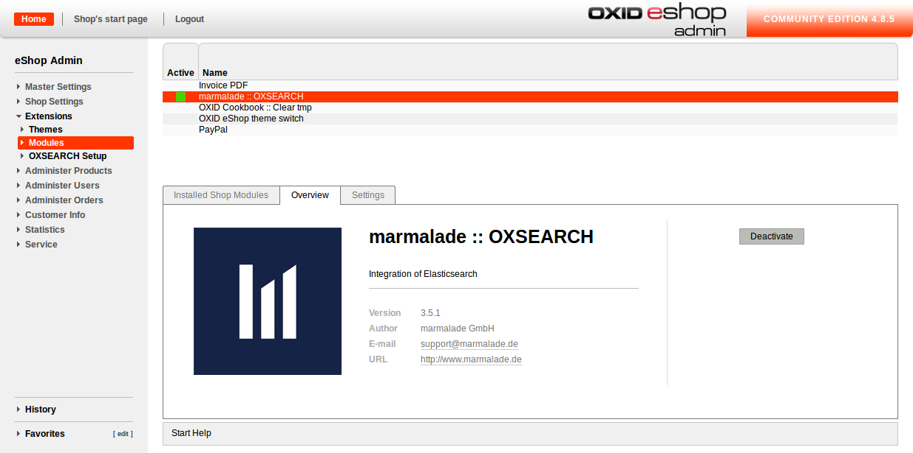

## Installation ##

1. Download the zip file of OXSEARCH.  
2. Install its contents to the path <ShopRoot>/modules/marm/oxsearch.  
3. Please make sure that the file <ShopRoot>/modules/marm/vendormetadata.php exists. If that's not the file, please create an empty file by that name.  
4. Now you can activate the extension in the OXID backend in Extensions > Modules > marmalade:: OXSEARCH.  
  
Clicking extensions on the left hand side, a new entry OXSEARCH-Setup now appears. Here, you can comfortably manage OXSEARCH.
