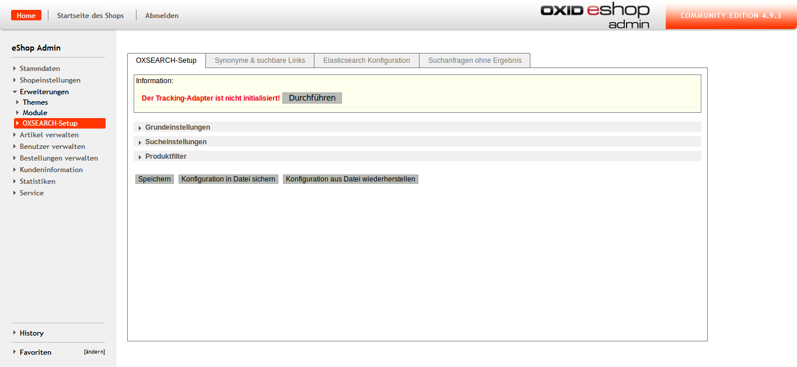
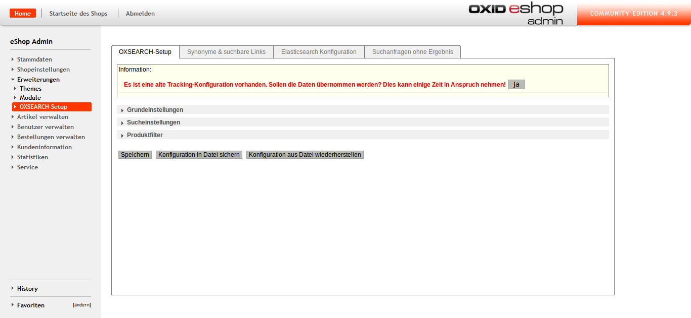
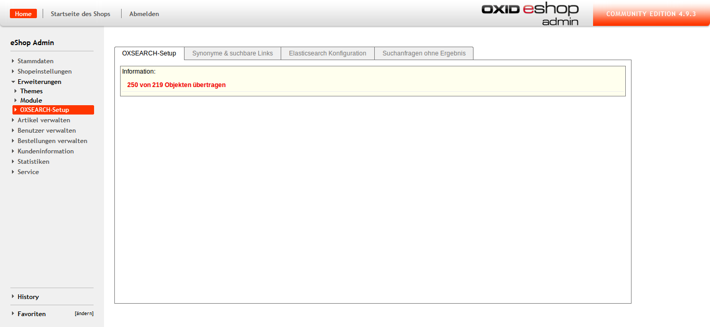

# Migration #

## Migration of tracking data ##

If the tracking adpater should be switched you have to follow these steps:

 1. The new adapter has to be configured with the option `$this->aOxSearchTracking` in `config.inc.php`.
    An older colfiguration should be renamed to `$this->aFormerOxSearchTracking`.
 2. The new system can be activated in the backend under _Extensions > OXSEARCH-Setup_.
 
    
    
 3. Existing data can be migrated:
 
    
    
    This can take a while.
 
    

 4. After migration the option `$this->aFormerOxSearchTracking` should be removed from `config.inc.php`.

## Migration from version 3.6.3 or older to 3.7.0 ##

 1. The OXSEARCH settings should be saved by clicking the corresponding button in backend.
 2. The module has to be deactivated before the update and reactivated afterwards.
 3. To migrate the existing tracking data, the option`$this->aFormerOxSearchTracking = array('adapter' => 'marm_oxsearch_intable_tracking');` has to be added to `config.inc.php` 
    and the steps 3 and 4 above should be executed.
 4. If the block `details_productmain_title` is missing in template `page/details/inc/productmain.tpl` following code should be added to the detail page template:

        [{include file="widget/tracking.tpl" product=$oDetailsProduct key="requested" delay=10000}]
